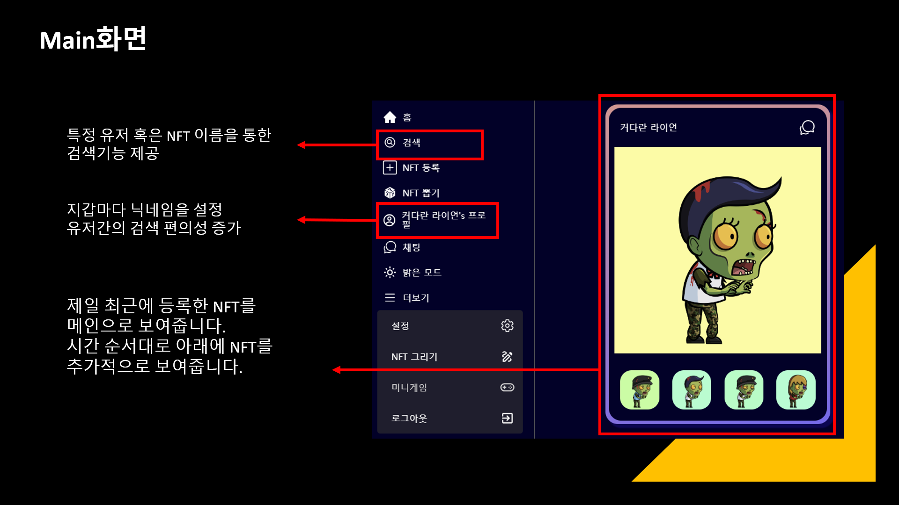
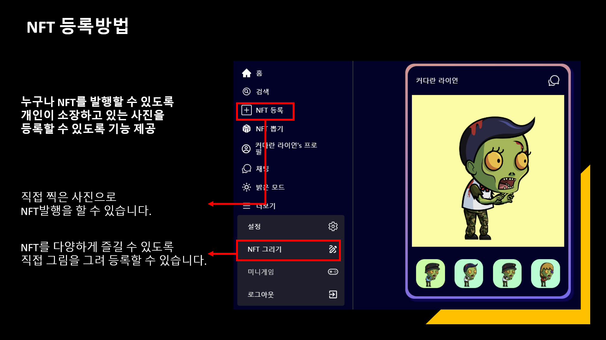
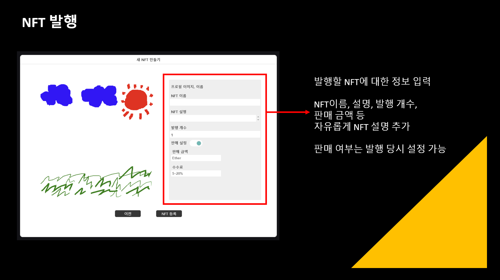
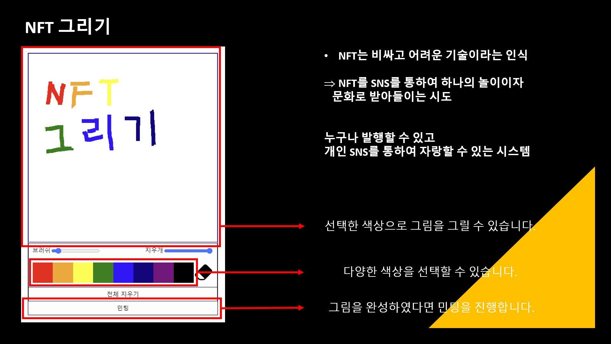

# NFstart

# 실행 방법

1. 서버 열기 /server : npm run start:dev
2. 리믹스 열기 /server : npx remixd -s . -u https://remix.ethereum.org
3. 클라이언트 열기 /client : yarn start

# API 문서

https://docs.google.com/spreadsheets/d/1WNNoKlkIGWdAMI7oV3XsJT_TXkGLHTJLSgcagQwdYi8/edit#gid=0

# 구현







# Git 진행 순서

- Merge

```bash
git checkout dev
git pull original dev
git checkout 본인branch
git rebase dev
git checkout dev
git merge 본인 branch
git push original dev
```

- Merge 이후

````bash
git checkout dev
git pull origin dev
git checkout 본인branch
git rebase dev
```bash
````
